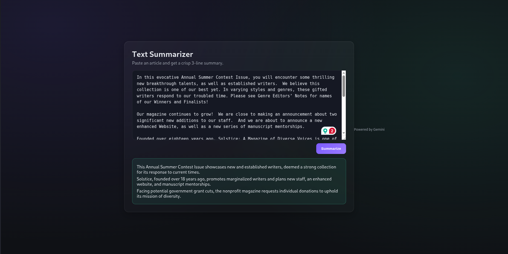

## Text Summarizer

A simple text summarization project with a separate backend and frontend.

### Why a Backend?
I initially considered building this with no backend, but I wasn’t sure how to safely handle and hide environment variables in a purely frontend setup (I have very little frontend experience). To avoid exposing secrets in the browser and to keep API keys/config secure, I created a dedicated backend along with the frontend.

### Architecture
- **Backend**: Go server, runs on port **4001**
- **Frontend**: React app, runs on port **3000**

### Prerequisites
- Node.js 18+ and npm (for the frontend)
- Go 1.21+ (for the backend)

### Environment Variables
Keep secrets in the backend only. If you have API keys or private configuration, add them to the backend environment (e.g., export in your shell or use a `.env` loader in Go if you add one). Do not put secrets in the frontend; anything in the frontend is public.

### Run the Backend (port 4001)
1. Open a terminal in the backend directory:
   - `cd backend`
2. Install modules (first run only):
   - `go mod tidy`
3. Run the server:
   - `go run main.go`

The backend should start on `http://localhost:4001`.

### Run the Frontend (port 3000)
1. Open another terminal in the frontend directory:
   - `cd frontend`
2. Install dependencies (first run only):
   - `npm install`
3. Start the dev server:
   - `npm start`

The app should open at `http://localhost:3000` and communicate with the backend on `http://localhost:4001`.

### Notes
- If you need to change ports, update the backend port in the Go server and match the API base URL in the frontend accordingly (e.g., via an environment variable at build time that does not contain secrets).
- Ensure CORS is configured in the backend if the frontend and backend run on different origins during development.

### Screenshot
